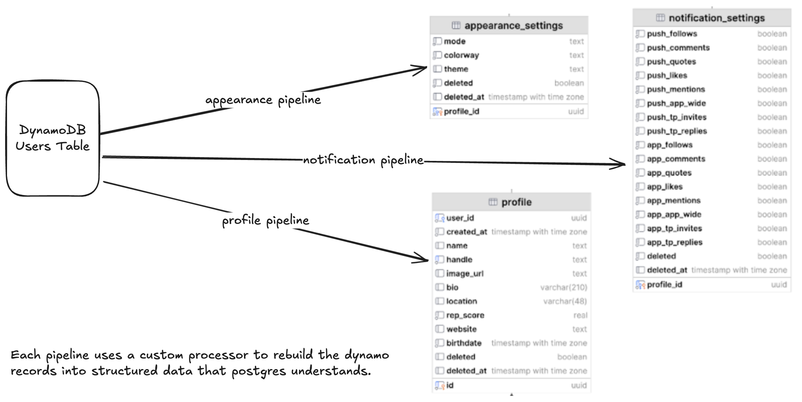

# DynamoDB to PostgreSQL Pipeline



This pipeline streams data from DynamoDB to PostgreSQL. It runs three pipelines that stream data into three different Postgres tables.
It uses processors to make sure that the data is correctly formatted for Postgres to consume.
There is a Python script provided that can generate sample records in real time continuously for testing.

## Setting up an AWS DynamoDB instance

1. Set up a DynamoDB table.

2. In the "Exports and streams" section in the Table settings, enable DynamoDB streams:
   - Check "Enable DynamoDB stream"
   - Select "New and old images" for the "View type"

   This setting enables Change Data Capture (CDC) for Conduit.

### Useful AWS CLI commands for DynamoDB

```bash
    # Create a DynamoDB table
    aws dynamodb create-table \
        --table-name users \
        --attribute-definitions AttributeName=id,AttributeType=S \
        --key-schema AttributeName=id,KeyType=HASH \
        --provisioned-throughput ReadCapacityUnits=1,WriteCapacityUnits=1 \
        --region us-east-2

    # Delete a DynamoDB table
    aws dynamodb delete-table --table-name users --region us-east-2

    # Scan all items in a DynamoDB table
    aws dynamodb scan --table-name users --region us-east-2

    # Count the number of items in a DynamoDB table
    aws dynamodb scan --table-name users --select "COUNT" --region us-east-2
```

## Setting up an Postgres instance

    - Use https://diffuser.meroxa.io/ to setup an AWS RDS Postgres instance.

### Useful PSQL commands for Postgres

```bash
    # Connect to the database
    psql -h <host> -U <username> -d <database_name>

    # Create the appearance_settings table
    CREATE TABLE appearance_settings (
        id UUID,
        mode TEXT,
        colorway TEXT,
        theme TEXT,
        deleted BOOLEAN,
        deleted_at TIMESTAMPTZ,
        profile_id UUID
    );

    ALTER TABLE appearance_settings
    ALTER COLUMN deleted_at DROP NOT NULL;

    # Create the notification_settings table
    CREATE TABLE notification_settings (
        id UUID,
        push_follows BOOLEAN,
        push_comments BOOLEAN,
        push_quotes BOOLEAN,
        push_likes BOOLEAN,
        push_mentions BOOLEAN,
        push_app_wide BOOLEAN,
        push_tp_invites BOOLEAN,
        push_tp_replies BOOLEAN,
        app_follows BOOLEAN,
        app_comments BOOLEAN,
        app_quotes BOOLEAN,
        app_likes BOOLEAN,
        app_mentions BOOLEAN,
        app_app_wide BOOLEAN,
        app_tp_invites BOOLEAN,
        app_tp_replies BOOLEAN,
        deleted BOOLEAN DEFAULT FALSE,
        deleted_at TIMESTAMPTZ DEFAULT NULL,
        profile_id UUID PRIMARY KEY -- Set profile_id as the primary key
    );

    # Create the profile table
    CREATE TABLE profile (
        id UUID,
        user_id UUID, -- Same as `id` from DynamoDB
        created_at TIMESTAMPTZ, -- Corresponds to `createdAt`
        name TEXT,
        handle TEXT,
        image_url TEXT,
        bio VARCHAR(210),
        location VARCHAR(48),
        rep_score REAL,
        website TEXT,
        birthdate TIMESTAMPTZ,
        deleted BOOLEAN DEFAULT FALSE, -- Default to FALSE
        deleted_at TIMESTAMPTZ -- Default to NULL
    );

    SELECT * FROM appearance_settings;
    SELECT * FROM notification_settings;
    SELECT * FROM profile;

    SELECT COUNT(*) AS total_profiles FROM profile;
    SELECT COUNT(*) AS total_appearance_settings FROM appearance_settings;
    SELECT COUNT(*) AS total_notification_settings FROM notification_settings;

    # Join the profile and appearance_settings tables using profile.id and appearance_settings.profile_id
    SELECT 
        p.*,  -- All fields from the profile table
        a.mode, 
        a.colorway, 
        a.theme, 
        a.deleted AS appearance_deleted, 
        a.deleted_at AS appearance_deleted_at
    FROM 
        profile p
    JOIN 
        appearance_settings a 
    ON 
        p.id = a.profile_id;  -- Join on profile.id and appearance_settings.profile_id
```
    

## DynamoDB Sample Data

    - Use the `scripts/insert_dynamo_records.py` script to insert sample data into the DynamoDB table.

```bash
    python scripts/insert_dynamo_records.py
```

## Map DynamoDB Fields to PostgreSQL Tables

Mapped Fields:

| DynamoDB users Field | PostgreSQL Table | PostgreSQL Column |
|:---------------------|:------------------|:-------------------|
| id | profile | id (UUID) |
| createdAt | profile | created_at (TIMESTAMPTZ) |
| name | profile | name (TEXT) |
| handle | profile | handle (TEXT) |
| imageUrl | profile | image_url (TEXT) |
| bio | profile | bio (VARCHAR(210)) |
| location | profile | location (VARCHAR(48)) |
| repScore | profile | rep_score (REAL) |
| website | profile | website (TEXT) |
| birthdate | profile | birthdate (TIMESTAMPTZ) |
| deleted | profile | deleted (BOOLEAN) |
| deletedAt | profile | deleted_at (TIMESTAMPTZ) |
| appearance.mode | appearance_settings | mode (TEXT) |
| appearance.colorway | appearance_settings | colorway (TEXT) |
| appearance.theme | appearance_settings | theme (TEXT) |
| appearance.deleted | appearance_settings | deleted (BOOLEAN) |
| appearance.deletedAt | appearance_settings | deleted_at (TIMESTAMPTZ) |
| notifications.push_follows | notification_settings | push_follows (BOOLEAN) |
| notifications.push_comments | notification_settings | push_comments (BOOLEAN) |
| notifications.push_quotes | notification_settings | push_quotes (BOOLEAN) |
| notifications.push_likes | notification_settings | push_likes (BOOLEAN) |
| notifications.push_mentions | notification_settings | push_mentions (BOOLEAN) |
| notifications.push_app_wide | notification_settings | push_app_wide (BOOLEAN) |
| notifications.push_tp_invites | notification_settings | push_tp_invites (BOOLEAN) |
| notifications.push_tp_replies | notification_settings | push_tp_replies (BOOLEAN) |
| notifications.deleted | notification_settings | deleted (BOOLEAN) |
| notifications.deletedAt | notification_settings | deleted_at (TIMESTAMPTZ) |
